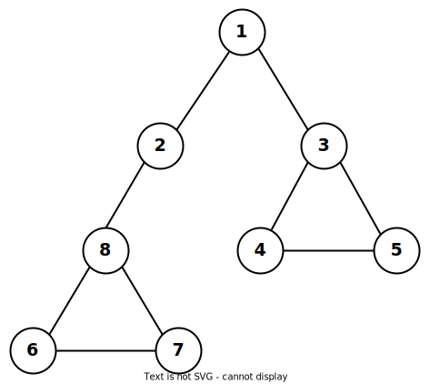
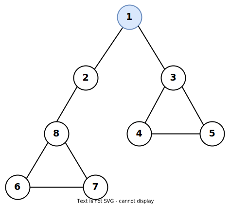
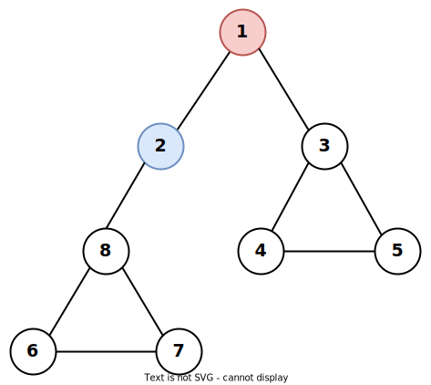
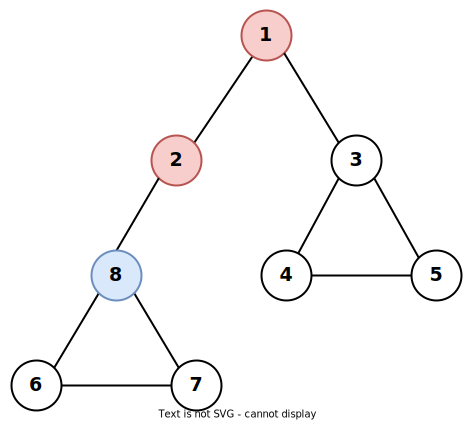
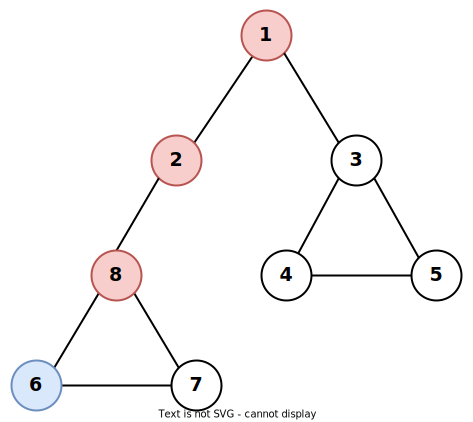
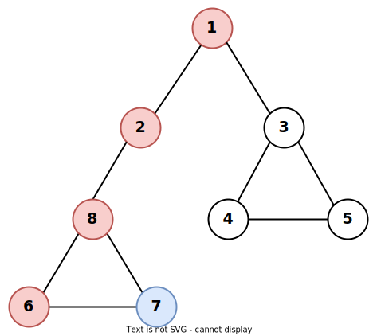
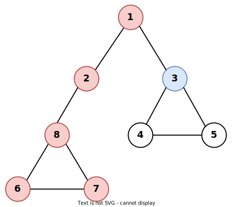
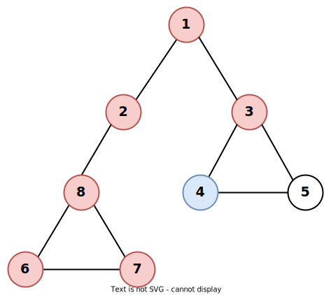
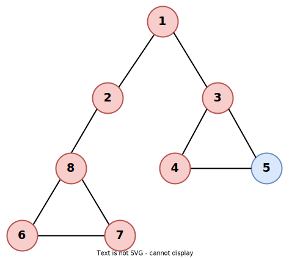

## 개념
트리나 그래프에서 한 루트로 탐색하다가 특정 상황에서 최대한 깊숙이 들어가서 확인한 뒤 다시 돌아가 다른 루트로 탐색하는 방식이다. 
- 일반적으로 자기자신을 호출하는 **재귀함수**의 형태이지만 단순한 스택 배열로 구현되기도 한다.
- 백트래킹에 자주 사용된다.
- 너비 우선 탐색에 비해 간단하다.
- 단순 검색 속도 자체는 너비 우선 탐색에 비해 느리다.


## 구현


```python
# DFS 메서드 정의
def dfs (graph, node, visited):
    # 해당 노드를 방문 처리
    visited[node] = True
    # 탐색 순서 출력
    print(node, end = ' ')
    # 한 노드로부터 인접한 다른 노드를 재귀적으로 방문 처리
    for i in graph[node]:
        if not visited[i]:
            dfs(graph, i, visited)
            
graph = [
    [],
    [2, 3],
    [1, 8],
    [1, 4, 5],
    [3, 5],
    [3, 4],
    [7, 8],
    [6, 8],
    [2, 6, 7]
]

# 노드별로 방문 정보를 리스트로 표현
visited = [False] * 9

# 노드 1부터 탐색 시작
dfs(graph, 1, visited)
```

위 코드의 `graph`를 시각화하면 아래와 같다.



### 과정 
*방문 우선순위 - 숫자가 작은 노드부터*
1. 노드 `1`에서부터 시작한다. 노드 1을 방문 처리한다.  

> $1$

2. `1`에서 가장 인접한 노드인 `2`를 방문하고 방문 처리한다.  

> $1 \rightarrow 2$

3. `2`와 인접한 노드 중 방문하지 않은 노드인 `8`을 방문하고 방문 처리한다.  

> $1 \rightarrow 2 \rightarrow 8$

4. `8`과 인접한 노드 중 방문하지 않은 노드인 `6`을 방문하고 방문 처리한다.

> $1 \rightarrow 2 \rightarrow 8 \rightarrow 6$

5. `6`과 인접한 노드중 방문하지 않은 노드인 `7`을 방문하고 방문 처리한다.

> $1 \rightarrow 2 \rightarrow 8 \rightarrow 6 \rightarrow 7$

6. `7`과 인접한 노드 중에는 방문하지 않은 노드가 없으므로 방문하지 않은 인접 노드가 있을 때까지 이전 노드로 돌아간다. 결국 `1`의 인접 노드인 `3`을 방문하고 방문 처리한다.

> $1 \rightarrow 2 \rightarrow 8 \rightarrow 6 \rightarrow 7 \rightarrow 3$

7. `3`과 인접한 노드 중 방문하지 않은 노드인 `4`를 방문하고 방문 처리한다.

> $1 \rightarrow 2 \rightarrow 8 \rightarrow 6 \rightarrow 7 \rightarrow 3 \rightarrow 4$

8. 마지막으로 남은 `5`를 방문한다.

> $1 \rightarrow 2 \rightarrow 8 \rightarrow 6 \rightarrow 7 \rightarrow 3 \rightarrow 4 \rightarrow 5$

### 결과
```text
1 2 8 6 7 3 4 5 
```

## 시간복잡도

$V$ : 정점(노드)의 개수  
$E$ : 간선의 개수

### 그래프를 인접 행렬로 표현할 경우  
모든 정점을 다 찾아봐야 하기 때문에 `dfs(x)`를 한 번 시행할 때 $O(V)$ 만큼의 시간이 든다.  
`dfs(x)`가 $V$번 호출되어야 하므로 전체 알고리즘의 시간복잡도는 $O(V*V) = O(V^2)$

### 그래프를 인접 리스트로 표현할 경우  
인접행렬과 마찬가지로 `dfs(x)`는 $V$번 호출된다.
각 `dfs(x)`는 해당 정점이 이어져 있는 간선의 개수만큼 `dfs(x)`를 시행하는데 이를 모두 합하면 $E$번이 된다.
즉, 시간복잡도는 $O(V+E)$이다.

일반적인 경우 인접 리스트의 방식이 더 효율적이다. 위의 예제도 그래프를 인접 리스트로 표현했다.