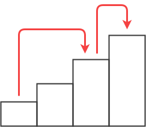
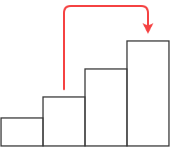

<div style='display: flex; gap: 20px;'><div style='color: gray; font-size: 17px;'>[Silver III]</div><a href='https://www.acmicpc.net/problem/2579'> 백준 2579번 - 계단 오르기</a></div>


### 풀이
1. 계단을 한 칸 오를 때  
    연속된 세 개의 계단을 오를 수 없으므로 한 칸을 올랐으면 이전에는  **무조건 두 칸을 올랐어야 한다.**
2. 계단을 두 칸 오를 때  
    다음에 한 칸을 오르든 두 칸을 오르든 상관없다.

그러므로 n번째 계단까지의 최고 점수는  
- n-3번째 계단까지의 최고점수 + n-1번째 계단의 점수 + n번째 계단의 점수
- n-2번째 계단까지의 최고점수 + n번째 계단의 점수  


<div style='display: flex; justify-content:space-around'>






</div>
두 값 중 더 큰 값이 n번째 계단까지의 최고 점수가 된다.


### 코드
```python
import sys 
n = int(sys.stdin.readline())
scores = []
for i in range(n):
  scores.append(int(sys.stdin.readline()))

if n == 1:
  print(scores[0])
elif n == 2:
  print(scores[0] + scores[1])
else:
  # 첫 번째, 두 번째, 세 번째 계단까지의 최고점수를 리스트에 저장한다.
  results = [scores[0], scores[0] + scores[1], max(scores[0] + scores[2], scores[1] + scores[2])]
  
  for i in range(3, n):
    results.append(max(results[i-3] + scores[i-1] + scores[i], results[i-2] + scores[i]))
  
  print(results[n-1])
```