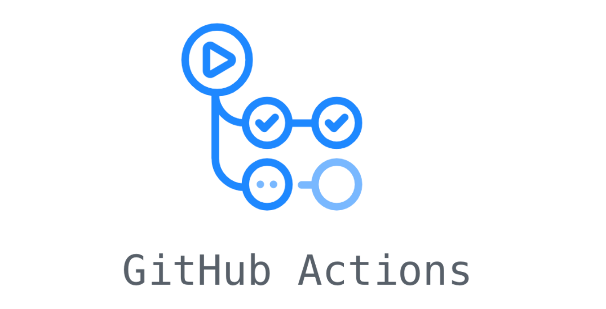
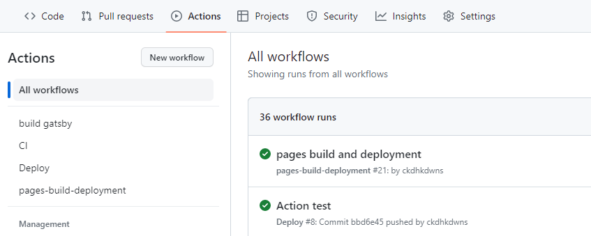

---
title: "GitHub Actions을 활용한 배포 자동화 구축하기"
date: 2023-04-22
tags: 
    - github-action
    - gatsby
--- 

### Github Action이란

**GitHub Actions**는 GitHub에서 제공하는 **개발 워크플로우 자동화 도구**로, 코드의 빌드, 테스트, 배포, 그리고 프로젝트 관리와 관련된 다양한 작업을 자동화할 수 있습니다. 이를 통해 개발자들은 시간과 노력을 절약하고, 효율성을 높일 수 있습니다.



1. **이벤트 기반 트리거** - GitHub Actions는 특정 이벤트에 기반하여 워크플로우를 실행할 수 있습니다. 예를 들어, 푸시, 풀 리퀘스트, 릴리즈, 스케줄링, 웹훅 등 다양한 이벤트가 있습니다.

2. **재사용 가능한 Actions** - 워크플로우를 구성하는 여러 단계는 재사용 가능한 작은 단위인 Actions로 구성됩니다. 개발자들은 GitHub 마켓플레이스에서 제공되는 Actions를 사용하거나, 직접 만들어 사용할 수 있습니다.

3. **여러 언어 및 플랫폼 지원** - GitHub Actions는 다양한 언어와 플랫폼을 지원합니다. JavaScript, Python, Java, Ruby, PHP, Go, Rust 등 대부분의 주요 프로그래밍 언어와 함께 macOS, Linux, Windows 등 다양한 운영체제에서 작동합니다.

4. **병렬 실행 및 매트릭스 빌드** - 여러 작업을 동시에 실행하거나, 다양한 환경에서 테스트를 수행하기 위해 매트릭스 빌드를 활용할 수 있습니다.

5. **환경 변수 및 Secrets 관리** - 워크플로우에서 사용할 환경 변수를 설정하거나, 민감한 정보를 안전하게 저장하고 사용할 수 있는 Secrets 기능을 제공합니다.

6. **빌트인 호스팅** - GitHub Actions는 빌트인 호스팅을 제공하여, 별도의 CI/CD 서비스를 사용할 필요가 없습니다. 이를 통해 개발자들은 간편하게 워크플로우를 구성하고 관리할 수 있습니다.

**GitHub Actions**를 사용하려면, 프로젝트의 .github/workflows 디렉터리에 워크플로우 YAML 파일을 작성해야 합니다. 워크플로우 파일에는 작업의 실행 조건, 실행 환경, 실행할 스텝 등에 대한 정보를 정의합니다. 이후 워크플로우를 실행하면, 각 작업은 독립적인 컨테이너에서 실행되며, 결과는 GitHub 저장소의 "Actions" 탭에서 확인할 수 있습니다.

### 사용 방법

기존에 Github Pages로 배포하던 Gatsby 블로그를 자동화하는 과정입니다.

1. `.github/workflows` 폴더에 `deploy.yml` 파일을 만듭니다. 파일 이름은 마음대로 지어도 무관합니다.
2. `deploy.yml` 파일에 다음과 같이 작성합니다.

```yaml
name: Deploy
on:
  push:
    branches:
      - master

jobs:
  deploy:
    runs-on: ubuntu-latest
    steps:
      - uses: actions/checkout@v2

      - name: Setup Node
        uses: actions/setup-node@v2.1.2
        with:
          node-version: '14.x'

      - name: Cache dependencies
        uses: actions/cache@v2
        with:
          path: ~/.npm
          key: ${{ runner.os }}-node-${{ hashFiles('**/package-lock.json') }}
          restore-keys: |
            ${{ runner.os }}-node-

      - run: npm install
      - run: npm run build

      - name: Deploy
        uses: peaceiris/actions-gh-pages@v3
        with:
          github_token: ${{ secrets.GITHUB_TOKEN }}
          publish_dir: ./public         
```

- `name` - 워크플로우의 이름을 지정합니다.
- `on` - 워크플로우를 실행할 트리거를 정의합니다. 이 경우 push 이벤트가 발생하고, 그 푸시가 master 브랜치에 대한 것일 때 워크플로우가 실행됩니다.
- `jobs` - 워크플로우에서 실행할 작업들을 정의합니다.
- `runs-on` - 작업이 실행될 환경을 지정합니다. 이 경우 ubuntu-latest로 설정되어 있어, 가장 최신 버전의 Ubuntu에서 작업이 실행됩니다.
- `steps` - 작업을 구성하는 스텝들을 정의합니다.
    - `actions/checkout@v2` - 저장소의 코드를 체크아웃하는 스텝입니다.
    - `Setup Node` -: Node.js를 설정하는 스텝입니다. 이 경우 '14.x' 버전의 Node.js를 사용하도록 설정되어 있습니다.
    - `Cache dependencies` - 의존성 패키지를 캐시하는 스텝입니다. 캐시를 사용하면 빌드 시간을 줄일 수 있습니다.
    - `npm install` - 의존성 패키지를 설치하는 스텝입니다.
    - `npm run build` - 프로젝트를 빌드하는 스텝입니다. Gatsby 블로그의 경우, gatsby build 명령어를 실행합니다.
    - `Deploy` - 빌드된 프로젝트를 GitHub Pages에 배포하는 스텝입니다. `peaceiris/actions-gh-pages@v3` 액션을 사용하여 배포를 진행하고 `GITHUB_TOKEN`을 사용해 인증합니다. 빌드된 파일들이 있는 `./public` 디렉토리를 배포 대상으로 지정합니다.  

<div></div> 

3. `master` 브랜치에 push합니다. 이후 해당 저장소의 `action` 탭을 확인해보면 정상적으로 배포가 된 것을 확인할 수 있습니다.

