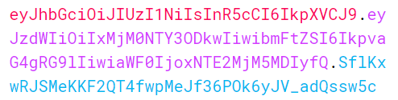

## 인증과 인가
인증과 인가는 둘 다 보안에 관련되어 있어 사람들이 쉽게 오용하는 용어들이다.
 

### 인증(Authentication) 
인증은 유저나 기기의 신원을 확인하는 절차이다. 예를 들어, 은행에 가서 계좌의 돈을 인출하려 할 때 점원은 당신이 누군지 알기 위해 신상 정보를 물어볼 것이다. 또한 당신이 비행기 티켓을 구매할 때, 티켓을 사용할 자격이 있는지 증명하기 위해 여권을 사용해야 한다. 두 예시는 현실에서 일어나는 신원 인증 절차를 보여준다. 

인터넷 상에서, 예를 들어, 당신의 페이스북 프로필이나 회사 메일에 접근하려 할 때는 여권 등을 제시하는 대신에 사용자 이름과 비밀번호를 입력하는 것으로 자신의 신원을 증명한다. 아이디와 비밀번호를 시스템에 입력하면 시스템은 당신의 신원을 확인하고 서비스에 접근할 수 있는 권한을 제공한다. 이 상황에서, 유저는 자신의 신원을 증명하기 위해 인증 요소를 사용한다. 이 인증 요소는 한 개가 될 수도 있고, 여러 개가 될 수도 있다.

### 인가(Authorization)
인증과 달리 인가는 어떤 개체가 어떤 리소스에 접근할 수 있는지 또는 어떤 동작을 수행할 수 있는지를 검증하는 것, 즉 접근 권한을 얻는 일을 말한다. 예를 들어, 공연장에 입장하기 위해 티켓을 구매할 때, 공연 기획사에서는 당신의 신원에 대해서는 관심이 없다. 당신이 공연장에 입장할 권한이 있는지 여부에만 관심이 있다. 입장 권한을 증명하려면 신분증이나 여권 대신 티켓만 있으면 된다. 티켓이 당신의 신원 정보를 포함하고 있지 않더라도 공연장에 입장할 수 있다.

인터넷에서는 일반적으로 **토큰**을 통해 인가를 다룬다. 유저가 로그인을 하면 앱은 사용자 신원을 바탕으로 인가 세부사항을 가진 토큰을 생성하게 된다. 시스템은 토큰을 이용해서 어떤 권한을 부여할 지, 즉 사용자의 접근을 허용할 지 거부할지를 결정한다.

### 인증 / 인가
- **인증**은 유저나 디바이스의 신원을 증명하는 것이다.
- **인가**는 유저나 디바이스에게 접근권한을 부여하는 것이다.

## JWT(JSON Web Token)

- **JWT(Json Web Token)** 은 유저 간의 정보를 JSON 객체로 안전하게 전송하기 위한 개방형 웹 표준(RFC 7519)이다. 이 토큰은 전자서명을 통해 검증되고 신뢰된다, 주로 *HMAC* 알고리즘이나 *RSA*나 *ECDSA*을 통해 서명된다.
- 세션 방식의 단점을 보완하고자 생긴 기술이다.
- 사용자의 고유성을 입증할 만한 데이터를 포장하여 토큰을 생성한다. 그리고 해당 토큰을 클라이언트에게 전송받았을 때, 해당 토큰안에 들어있던 고유 데이터로 사용자를 식별하여, 별도의 인증 과정없이 바로 작업을 수행할 수 있다.

### 구성

기본적인 형태는 아래와 같다.  


토큰에 있는 `.`을 기준으로 **Header**, **Payload**, **Signature**로 나뉜다.

#### Header   
Signature를 해싱하기 위한 알고리즘 정보들이 담겨져 있다.
```json 
{
  "alg": "HS256",
  "typ": "JWT"
}
```
이 정보는 *BASE64*로 인코딩된다.
#### Payload
서버와 클라이언트가 주고받는, 시스템에서 실제로 사용될 정보 *Claims*를 담고있다.
```json
{
  "sub": "1234567890",
  "name": "John Doe",
  "iat": 1516239022
}
```
*Claims*에는 *Registered claims*, *Public claims*, *Private claims*가 있다.

- **Registered claims** - 미리 정의된 *Claims* 세트이다. 보낸 사람, 받는사람, 만료시간 등의 정보를 담고 있다. 필수는 아니다.
- **Public claims** - 사용자에 의해 임의로 정의되는 *Claims*이다.
- **Private claims** - *Public claims*와 비슷하게 사용자에 의해 임의로 정의되지만, 유저를 특정할 수 있는 정보들을 담고 있다.

#### Signature
토큰의 유효성 검증을 위한 문자열이다.
```javascript
HMACSHA256(
  base64UrlEncode(header) + "." +
  base64UrlEncode(payload),
  your-256-bit-secret
)
```
토큰의 헤더, 페이로드와 서버가 갖고 있는 유일한 key 값을 헤더에서 정의한 알고리즘으로 암호화한다.


### 장점
- 중앙의 인증서버, 데이터 스토어에 대한 의존성이 없어 시스템 수평 확장 유리
- Bas64 URL Safe Encoding을 사용하기 때문에 URL, Cookie, Header에서 모두 사용할 수 있는 범용성을 거지고 있음

### 단점
- Payload의 정보가 많아지면 네트워크의 사용량이 증가함
- 토큰이 클라이언트에 저장되기 때문에 서버에서는 클라이언트의 토큰을 조작할 수 없음

