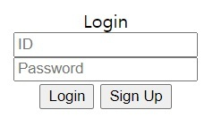
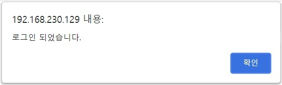

## 실습환경
칼리 리눅스에서 아파치 웹 서버를 열어 실습을 진행하였다.


>  Kali-Linux: 5.4.0  
> Apache: 2.4.41


## 코드 분석

login.php
페이지에 들어가면 간단한 로그인 폼이 있다.

```javascript
    ...
   	$id=$_POST['id'];
        $pw=$_POST['pw'];
 
        $query = "select * from member where id='$id' and pw='$pw'";
        $result = $connect->query($query);
 
 
        if(mysqli_num_rows($result)==1) {
                 $_SESSION['userid']=$id;
                if(isset($_SESSION['userid'])){
                ?>      <script>
                                alert("로그인 되었습니다.");
                                location.replace("./index.php");
                        </script>
                <?php
                } else{
                        echo "session fail";
                } 
        } else{
                ?> <script>
                       alert("아이디 혹은 비밀번호가 잘못되었습니다.");
                       history.back();
                </script> <?php
    ...
```
로그인을 처리하는 코드이다. POST 형식으로 id와 pw를 받고 query 구문을 통해 DB에서 id와 pw가 일치하는 정보를 찾는다. 

취약점이 있는 부분은 바로 아래 코드 부분이다.


```php
	$query = "select * from member where id='$id' and pw='$pw'";
        $result = $connect->query($query);
 
 
        if(mysqli_num_rows($result)==1) { ...
```
요청에서 받아온 id와 pw값을 검증 없이 그대로 사용하고 있다. 
pw값에 `' or id='admin'#`를 대입하면 로그인 폼이 우회된다.



## 원리
쿼리 부분을 다시 보자.

```php
	$query = "select * from member where id='$id' and pw='$pw'";
```
여기서 pw값에 `' or id='admin'#`가 들어간다면
```php
	$query = "select * from member where id='$id' and pw='' or id='admin'#'";
```
위와 같은 형태가 된다.   
SQL상에서 AND연산자는 OR연산자보다 우선순위가 높다. 
[MYSQL 연산자 우선순위](https://www.mysqltutorial.org/mysql-or/)

```php
	$query = "select * from member where (id='$id' and pw='') or id='admin'#'";
```
결국 쿼리문은 DB에서 id가 admin인 row를 찾고 인증을 우회하게 되는 것이다. 

제일 상단의 코드를 보면 사용자가 입력한 id값에 따라 세션이 생성된다. 즉, 공격자가 유저들의 id를 알기만 하면 그 유저의 권한을 가질수 있게 되는 것이다.


## 취약점 보완
1. `SELECT`, `UNION`과 같은 SQL 함수와 특수문자를 필터링

2. id와 pw를 한 번에 검색하는 방식 -> id만 검색하고 pw는 id 검색 후 나온 row의 pw와 대조

3. if문 안의 동치연산자 `==`를 `===`로 변경 


## 결과
```javascript
	$id=preg_replace("/[\'\;\"\=\-\-\#\/*]+/","", $_POST['id']);
        $pw=$_POST['pw'];

        if(preg_match('/(union|select|from|where)/i', $id)){
                exit();
        }
        $query = "select * from member where id='$id'";
        $result = $connect->query($query);
 
 
        if(mysqli_num_rows($result) === 1) {
                $row=mysqli_fetch_assoc($result);
                if($row['pw'] === $pw) {
                        $_SESSION['userid']=$id;
                        if(isset($_SESSION['userid'])) {
                        ?> <script>
                                alert("로그인 되었습니다.");
                                location.replace("./index.php");
                        </script> <?php
                        } else {
                                echo "session fail";
                        } 
                } else {
                        ?> <script>
                               alert("아이디 혹은 비밀번호가 잘못되었습니다.");
                               history.back();
                        </script> <?php
                }
        } else {
                ?> <script>
                       alert("아이디 혹은 비밀번호가 잘못되었습니다.");
                       history.back();
                </script> <?php
        }
```